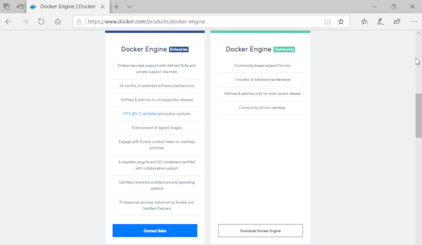
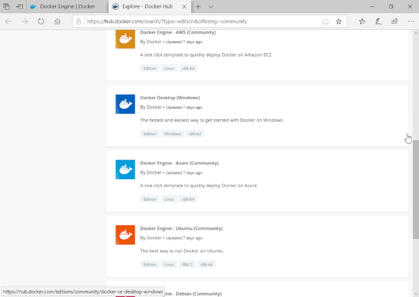
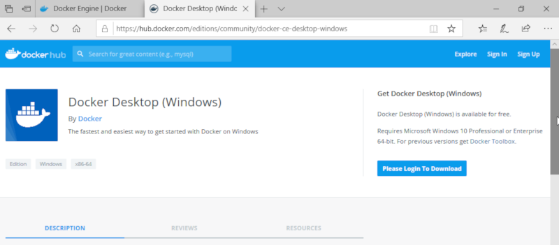
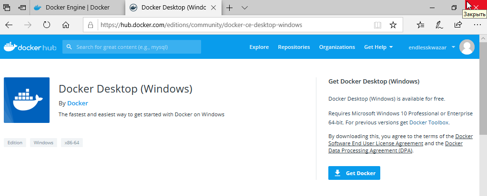
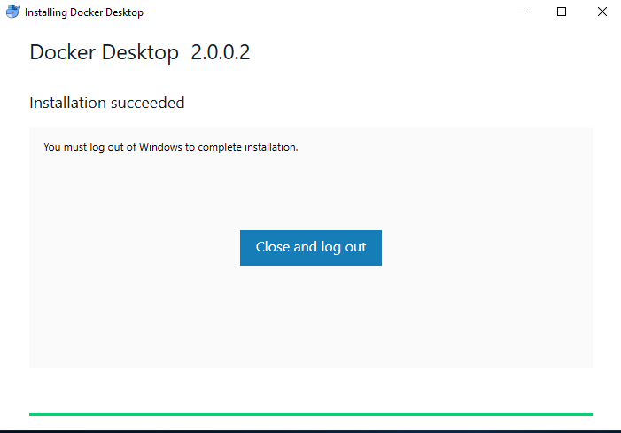
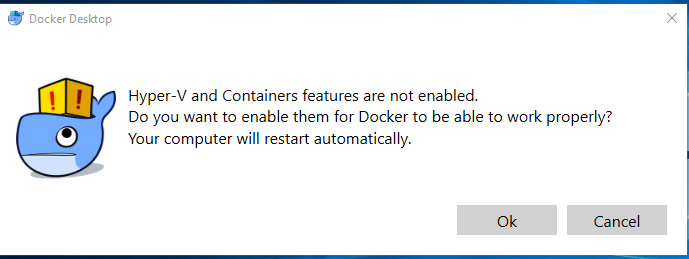
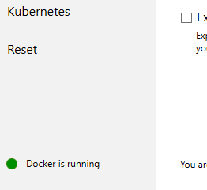
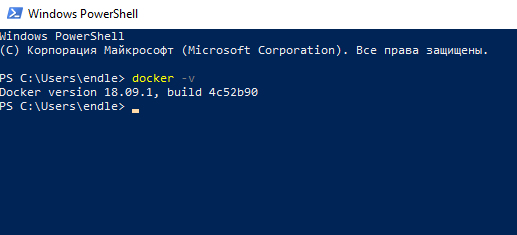

# Зміст

${toc}

# Що таке Docker?

**Docker** — інструментарій для управління ізольованими Linux-контейнерами. Docker доповнює інструментарій LXC більш високорівневим API, що дозволяє керувати контейнерами на рівні ізоляції окремих процесів.

**Docker** - це відкрита платформа для розробки, доставки і експлуатації додатків.


# Для чого може знадобитися Docker?

Платформа і засоби контейнерної віртуалізації можуть бути корисні в таких випадках:

- пакування вашого застосунку (і так само використовуваних компонентів) в docker контейнери;
- роздача і доставка цих контейнерів вашим командам для розробки і тестування;
- викладання цих контейнерів в продакшн, як в дата-центри так і в хмари.

# Відмінність від віртуалізації

Спочатку віртуалізація була покликана позбавити від подібних проблем, але в ній є суттєві недоліки:

- повільне завантаження;
- можлива плата за надання додаткового простору;
- не всі віртуальні машини (VM) підтримують сумісний використання;
- підтримують VM часто вимагають складної настройки;
- образ може бути занадто великим, так як «додаткова ОС» додає гігабайт простору в проект поверх операційної системи, а в більшості випадків на сервер ставиться кілька VM, які займають ще більше місця.

# Платформи

Докер працює не тільки на його рідній ОС, Linux, але також підтримується Windows і macOS. Єдина відмінність від взаємодії з Linux в тому, що на macOS і Windows платформа инкапсулируется в крихітну віртуальну машину. На даний момент Докер для macOS і Windows досяг значного рівня зручності у використанні.

Крім того, існує безліч додаткових додатків, таких як Kitematic або Docker Machine, які допомагають встановлювати і використовувати Docker на платформах, відмінних від Linux.

# Установка Docker на Windows

Перейдіть на сайт [https://www.docker.com](https://www.docker.com):


---

З розділу Products виберіть Docker Engine. Нас цікавить Docker Engine Comminity:



---

У новій вкладці Docker Hub виберіть Docker Desktop for Windows:



---

Щоб мати змогу завантажити Docker потрібно ввійти або створити оьліковий запис в Docker Hub(це безкоштовно). Після чього стане доступка кнопка Get Docker:





---

Запустіть скачаний файл і установіть Docker залишивши всі параметри за замовчуванням після чього перезайдіть в систему:



---

Після того як Ви перезайшли в систему Docker спробує запуститися. Тут існує доволі вилика імовірність того, що це не вдасться. Справа в тім, що Docker потребує для своєї роботи Hyper-V, який за замовчуванням вимкнений в операційній системі Windows. Docker видасть повідомлення про те, що Hyper-V не ввімкнено і запропонує це зробити. Натискаємо Ok, після чого система перезавантажиться.



---

Після перезавантаження Docker повинен успішно запуститися:



Для перевірки роботоспособності Docker відкрийте Power Shell і виконайте команду:

```bash
docker -v
```



# Налаштування Docker на Windows

# Домашнє завдання

Створіть файл main.java, який містить клас із методом main. В залежності від операційної системи створіть файл .bat або .sh, який збудує, запакує файл в jar і запустить його.

# Контрольні запитання

1. Що таке Docker? Назвіть області застосування Docker.
2. Чим Docker відрізняється від віртуалізації?
3. Як працює JVM?
4. Поясніть процес збирання java - додатка.